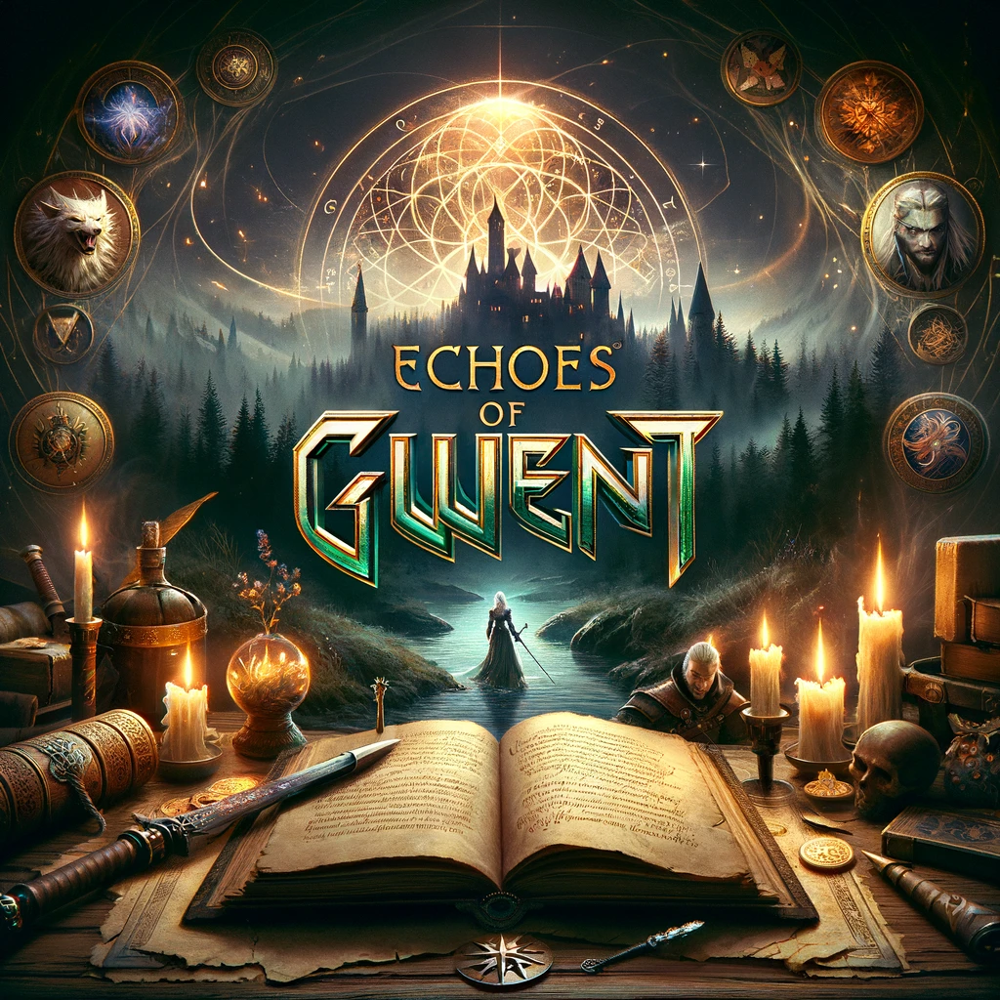

# Echoes of Gwent

## Téma

**Echoes of Gwent** je dynamická webová aplikace postavená na základech React frameworku, která nabízí fanouškům Zaklínače možnost ponořit se do digitálního světa oblíbené karetní hry Gwent. Aplikace je navržena tak, aby poskytovala uživatelům interaktivní a vizuálně poutavý herní zážitek, přičemž věrně zachovává pravidla a atmosféru originální hry známé z univerza Zaklínače. Hráči mají k dispozici režim pro jednoho hráče, kde mohou vyzvat umělou inteligenci, nebo se mohou věnovat strategickému zdokonalování svých balíčků prostřednictvím bojů proti rozmanitým protivníkům.

Jedinečným prvkem **Echoes of Gwent** je hluboce zapojená příběhová kampaň, která hráče provede skrze bohaté narativy inspirované fascinujícím světem Zaklínače. Tato kampaň umožňuje hráčům nejen prozkoumat nové příběhové linie a interagovat s ikonickými postavami, ale také odemykat nové karty, které se stávají klíčovými prvky pro rozvoj jejich balíčků. Postupem příběhu a úspěchy v kampani si hráči otevírají přístup k exkluzivním kartám, které mohou následně využít v solo režimu a v turnajích. Tím se rozšiřují možnosti pro strategickou hru a umožňuje hráčům stále se zdokonalovat a přizpůsobovat své strategie pro různé herní výzvy.

**Echoes of Gwent** tedy nabízí nejen tradiční zážitek z hraní Gwentu, ale také přidává novou dimenzi strategické hloubky a příběhového prožitku, čímž vytváří bohatý a komplexní herní svět, který je přístupný online bez nutnosti jakékoliv instalace.

## Funkcionalita

- **Herní režimy**: Echoes of Gwent nabízí dva hlavní herní režimy – solo hru proti pokročilé umělé inteligenci, která poskytuje reálnou výzvu i pro zkušené hráče, a tréninkový mód, kde mohou hráči experimentovat a zdokonalovat své strategie a balíčky bez tlaku na výsledek.

- **Vylepšení balíčků**: Hráči mají možnost sbírat karty a systematicky vylepšovat své balíčky prostřednictvím výher v duelích nebo výměnou s ostatními hráči či systémem. Nové karty lze získat také postupem v příběhové kampani, která otevírá exkluzivní karty při dosažení určitých milníků.

- **Interaktivní tutoriál**: Pro nováčky i pro hráče, kteří si chtějí osvěžit pravidla, Echoes of Gwent poskytuje interaktivní tutoriál. Ten hráče krok za krokem provádí pravidly Gwentu a základními i pokročilými strategiemi, čímž zajišťuje, že i úplní začátečníci mohou rychle začít hrát a užívat si hru na plno.

- **Turnaje a výzvy**: Aplikace pravidelně hostí turnaje a speciální výzvy, kde mohou hráči testovat své dovednosti proti ostatním a získávat unikátní odměny, které nelze získat jinak. Tyto eventy nabízejí jedinečnou příležitost pro hráče, aby se ukázali v konkurenčním prostředí a zároveň si rozšířili svou sbírku karet.
  
- **Příběhová kampaň**: Jádrem Echoes of Gwent je také rozsáhlá příběhová kampaň, která hráče zavede do hlubin světa Zaklínače. Skrze narativně vedené mise s rozvětvenými cestami a rozhodnutími, která mají vliv na průběh hry, mohou hráči odemykat speciální karty a vylepšení, které pak využijí v solo režimu i v turnajích.
  
- **React Router pro navigaci**: Echoes of Gwent využívá React Router pro plynulý a intuitivní přechod mezi různými částmi aplikace, ať už jde o přepínání mezi herními režimy, procházení karetní knihovnou, nebo sledování postupu v příběhové kampani.
  
- **Local Storage pro ukládání progressu**: Hra používá Local Storage k ukládání postupu hráčů, což umožňuje kdykoliv pokračovat ve hře nebo se vrátit k nedokončenému duelu. To zajišťuje, že hráči mohou snadno navázat na svůj poslední progress bez ztráty dat, což je ideální pro hru na různých zařízeních nebo pro hráče s omezeným časem.

## Odkazy pro vývoj

- figma návrh stránek aplikace
- odkaz na gh-pages projektu
- odkaz do repozitáře projektu, pokud pracuji v teamu a zde vývoj neprobíhá

### Techniky

- využití localStorage / sessionStorage
- čtení dat z externího RestAPI (fetch)
- operace DnD
- využití react-routeru
- funkčnost na mobilu (výjimka je předělávka komplexních deskových her)

### Co není obsahem 

- databáze
- bez vlastních backend service
- trapné věci: *klasické karetní hry*, *člověče nezlob se*, ...
